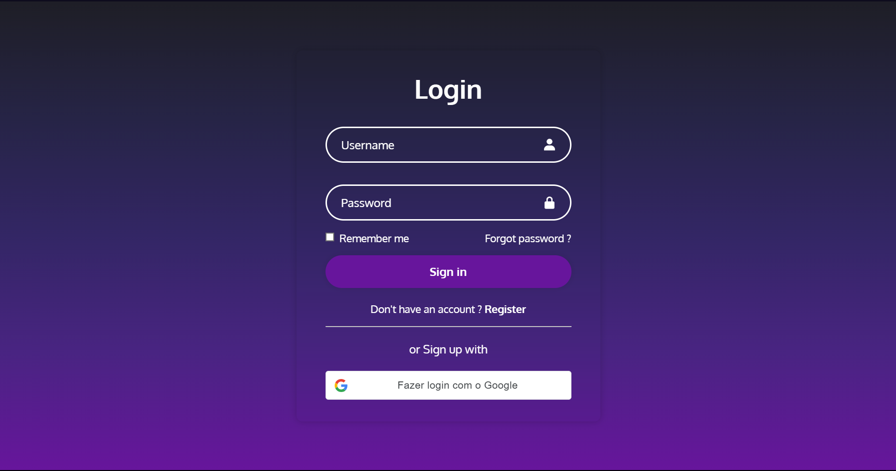
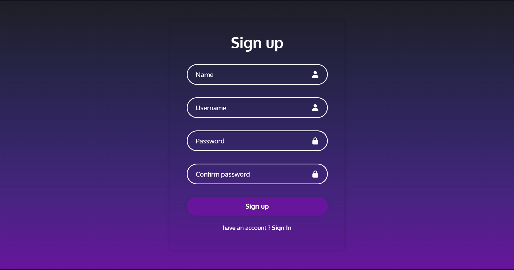
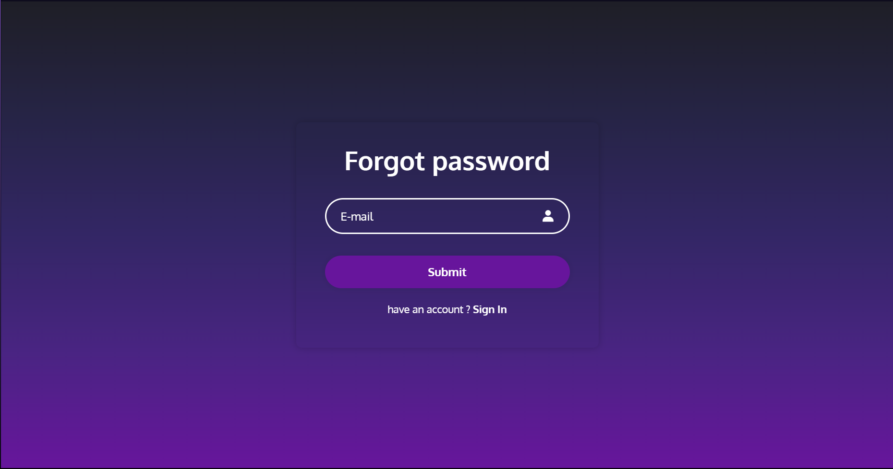

# 🌟 Bem-vindo ao Projeto de Autenticação de Usuários! 🌟

Este é um projeto incrível de uma página de autenticação de usuários, criada especialmente para meu portfólio. Aqui, você encontrará uma experiência de usuário elegante e interativa para login, cadastro e recuperação de senha. E o melhor de tudo? É tudo no **front end**!

## ✨ Funcionalidades Incríveis

- **Página de Login:** Faça login de forma rápida e fácil com uma interface intuitiva.
- **Página de Cadastro:** Registre-se com apenas alguns cliques e entre para a comunidade.
- **Recuperação de Senha:** Esqueceu sua senha? Sem problemas! Recupere-a de forma segura.

## 🚀 Tecnologias Utilizadas

- HTML5
- CSS3
- JavaScript (ES6+)

## 🎨 Design Responsivo

Este projeto foi desenvolvido com um design responsivo, garantindo uma ótima experiência de usuário em todos os dispositivos, desde smartphones até desktops.

## 👩‍💻 Como Usar

1. Clone este repositório em sua máquina local:

```bash
git clone https://github.com/seu-usuario/seu-projeto.git
```


## 📸 Capturas de Tela








## 🎉 Contribua

Contribuições são mais que bem-vindas! Sinta-se à vontade para abrir problemas (issues) ou enviar pull requests para melhorar este projeto.


*Nota: Este projeto é puramente front-end e não possui funcionalidades de autenticação segura. Foi desenvolvido exclusivamente para fins de demonstração e para mostrar minhas habilidades em desenvolvimento web.